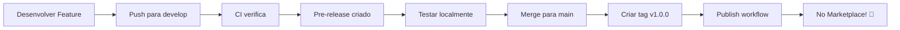

# 🤖 GitHub Automation

Esta pasta contém todos os arquivos de automação e CI/CD do projeto.

## 📁 Estrutura

```
.github/
├── workflows/              # GitHub Actions workflows
│   ├── ci.yml             # CI - Integração Contínua
│   ├── publish.yml        # Publicação automática no Marketplace
│   └── pre-release.yml    # Pre-releases para testes
├── release.yml            # Configuração de release notes
├── WORKFLOWS.md           # 📖 Guia completo dos workflows
├── SECRETS_SETUP.md       # 🔐 Como configurar secrets
└── README.md             # 📄 Este arquivo
```

## 🚀 Quick Start

### 1. Configurar Secrets (Primeira vez)

Para publicar automaticamente, configure o token:

👉 **Leia**: [SECRETS_SETUP.md](SECRETS_SETUP.md)

**Resumo rápido:**
1. Criar token em: https://dev.azure.com → Personal Access Tokens
2. Adicionar secret no GitHub: Settings → Secrets → Actions → `VSCE_TOKEN`

### 2. Publicar uma Nova Versão

```bash
# Atualizar versão
npm version patch  # 1.0.0 → 1.0.1

# Push (cria tag automaticamente)
git push
git push --tags

# GitHub Actions publica automaticamente! 🎉
```

### 3. Ver Workflows em Ação

```
https://github.com/lucasbiel7/cucumber-java-runner/actions
```

## 📚 Documentação Completa

- **[WORKFLOWS.md](WORKFLOWS.md)** - Guia completo dos workflows
- **[SECRETS_SETUP.md](SECRETS_SETUP.md)** - Como configurar secrets
- **[release.yml](release.yml)** - Configuração de release notes

## 🔄 Workflows Disponíveis

### ✅ CI (Integração Contínua)
- **Trigger**: Push/PR para `main` ou `develop`
- **Ações**: Compila, testa, cria pacote .vsix
- **Badge**: [](https://github.com/lucasbiel7/cucumber-java-runner/actions/workflows/ci.yml)

### 🚀 Publish (Publicação)
- **Trigger**: Tag `v*` (ex: v1.0.0)
- **Ações**: Publica no Marketplace + cria GitHub Release
- **Badge**: [](https://github.com/lucasbiel7/cucumber-java-runner/actions/workflows/publish.yml)

### 🧪 Pre-Release (Beta)
- **Trigger**: Push para `develop` ou manual
- **Ações**: Cria pre-release no GitHub para testes

## 🎯 Fluxo de Trabalho Recomendado



**Em texto:**

1. **Desenvolver** → feature branch
2. **PR para develop** → CI roda automaticamente
3. **Merge para develop** → Pre-release criado
4. **Testar** → Baixar .vsix e testar
5. **Merge para main** → Quando estiver pronto
6. **Criar tag** → `npm version patch && git push --tags`
7. **Publicado!** → Automaticamente no Marketplace

## ⚙️ Configurações

### release.yml

Define como as release notes são geradas automaticamente.

**Categorias configuradas:**
- 🚀 New Features
- 🐛 Bug Fixes
- 📝 Documentation
- 🔧 Maintenance
- ⚡ Performance
- 🧪 Tests
- 🎨 UI/UX

**Como usar:**
Adicione labels nos seus commits/PRs:
```bash
git commit -m "feat: nova funcionalidade" # → New Features
git commit -m "fix: correção de bug"      # → Bug Fixes
git commit -m "docs: atualiza README"     # → Documentation
```

## 🐛 Troubleshooting

### Workflow não executou

**Verificar:**
- [ ] Push foi feito na branch correta?
- [ ] Tag tem formato `v*`?
- [ ] Arquivo .yml está em `.github/workflows/`?

### Erro de publicação

**Verificar:**
- [ ] Secret `VSCE_TOKEN` está configurado?
- [ ] Token não expirou?
- [ ] Publisher existe no marketplace?
- [ ] Versão no package.json foi incrementada?

### Ver logs detalhados

1. Acesse: Actions
2. Clique no workflow que falhou
3. Clique no job
4. Veja logs de cada step

## 📊 Métricas

Após configurar, você pode ver:

- ✅ Quantos builds passaram/falharam
- 📦 Quantas versões foram publicadas
- ⏱️ Tempo médio de build
- 📈 Histórico de releases

Acesse: **Insights** → **Actions**

## 🔗 Links Úteis

- [GitHub Actions Documentation](https://docs.github.com/en/actions)
- [VS Code Publishing Guide](https://code.visualstudio.com/api/working-with-extensions/publishing-extension)
- [Azure DevOps PAT](https://learn.microsoft.com/en-us/azure/devops/organizations/accounts/use-personal-access-tokens-to-authenticate)

---

**Automação configurada! 🚀**

Qualquer dúvida, consulte os guias detalhados ou abra uma issue!
